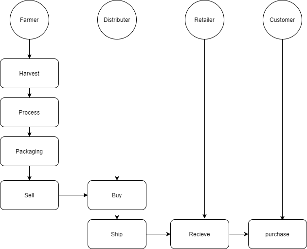
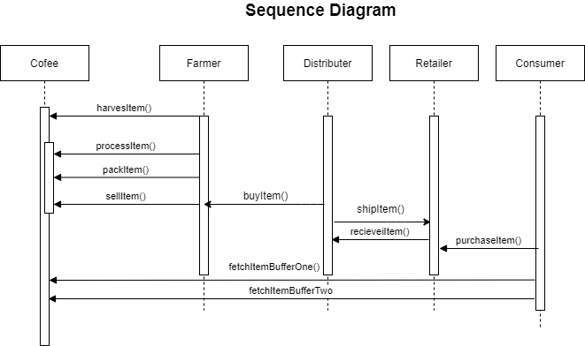
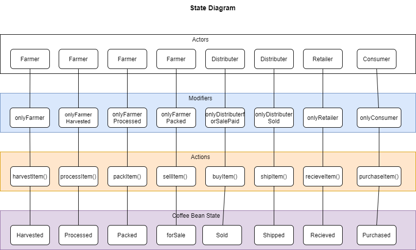
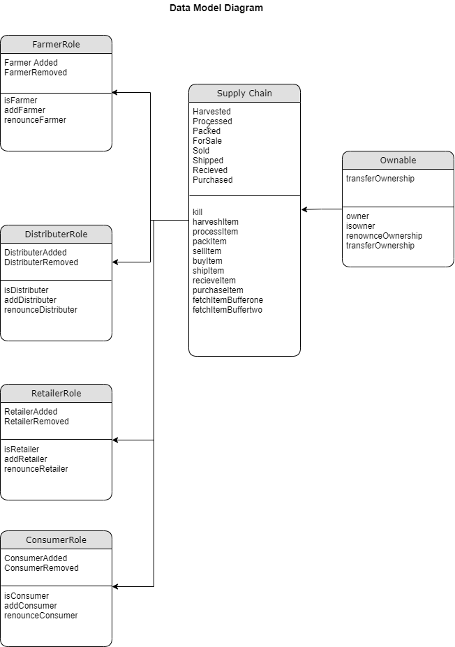
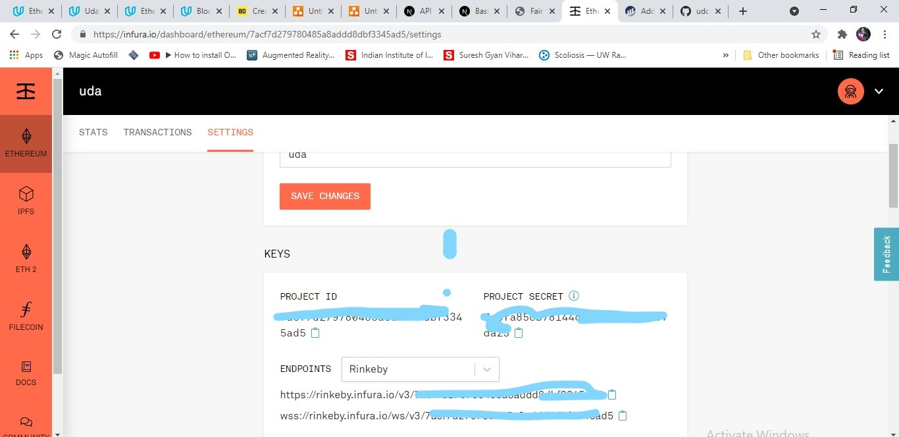
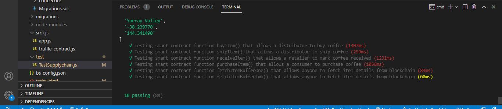
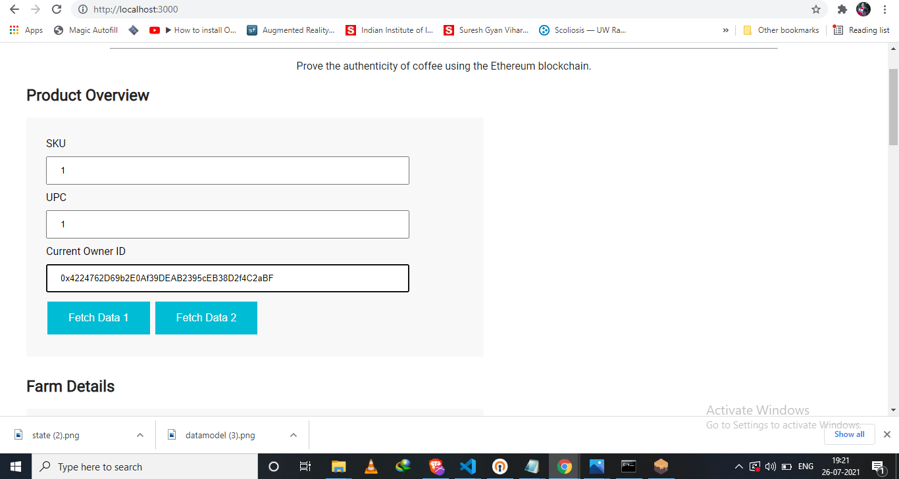
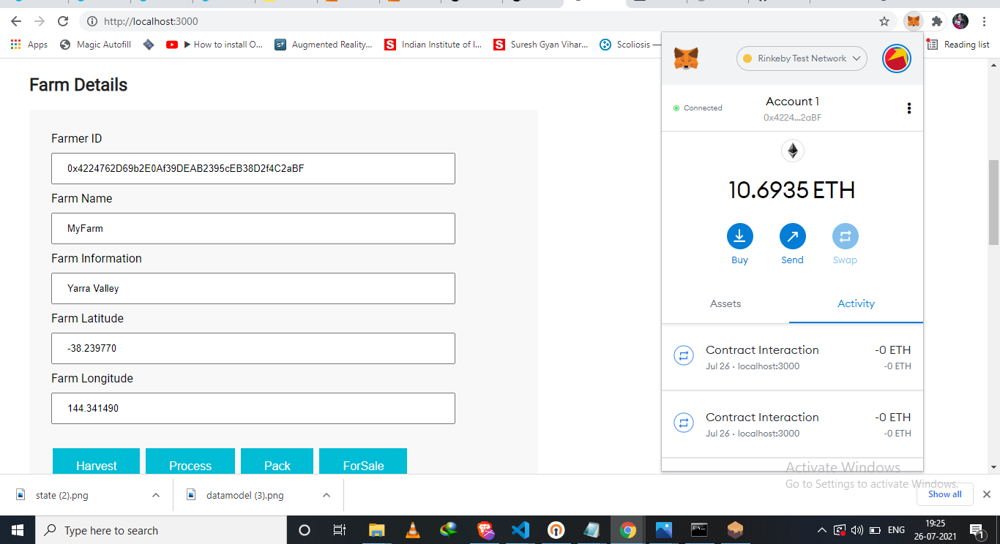
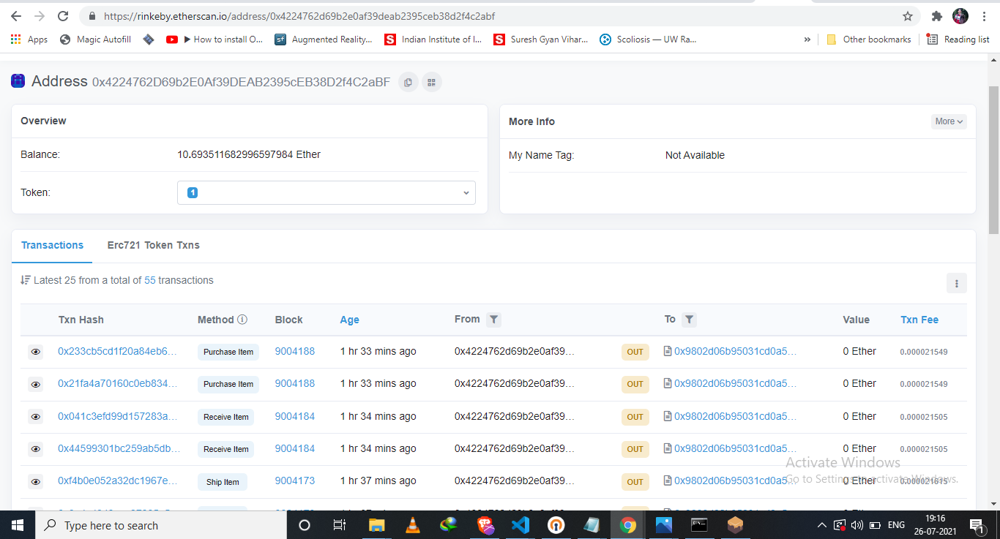

# Supply chain & data auditing

This repository containts an Ethereum DApp that demonstrates a Supply Chain flow between a Seller and Buyer. The user story is similar to any commonly used supply chain process. A Seller can add items to the inventory system stored in the blockchain. A Buyer can purchase such items from the inventory system. Additionally a Seller can mark an item as Shipped, and similarly a Buyer can mark an item as Received.


## Designing


### Activity Diagram

The  activity diagram shows the behavior of the system. It represents the flow 
from one activity to another in the system. We use the activity diagram to discover Actors and interactions in the supply chain.



### Sequence Diagram

The sequence diagram shows the  functions and events in the system It shows the interaction between
various objects in order of the sequence in which the interaction takes place. 



### State Diagram 

Shows the possible states the transition from one state to another. 



### Data model

 It models relationship and attributes ofthe supply chain smart contract. 




## Versions Used

```
node version number: v12.14.1

Truffle version number:  v4.1.14

Solidity: v0.4.24

web3 version number: 0.20.6

```

### Prerequisites

You must be familiar with the basic concepts and tools related to developing decentralized 
applications on Ethereum Blockchain.

1. Download and install [Node Version Manager]( https://github.com/nvm-sh/nvm#installation-and-update ) 
  (optional but highly recommended)

2. Download and install npm and [ nodejs ]( https://nodejs.org/en/ ). If you are using NVM, then 
  the latest version nodejs can be installed as: 
    ```
    nvm install node
    ```
3. Install [Ganache](https://www.trufflesuite.com/docs/ganache/quickstart)  development blockchain.

4. Install the command line version of Ganache as well.
    ```
    npm install -g ganache-cli
    ```

5. Install [Metamask](https://metamask.io/) Wallet for your browser. We will use Metamask wallet to sign
  transactions to be executed on our deployed contract on  Testnets (Rinkeby) and optionally on a local blockchain.
  If you already have a Metamask account, I recommend creating and using a *development* vault that
  doesn't have real Ether in yet. This way you won't accidentally lose any real money. You can always re-create/import your original wallet using the seed phrase/mnemonic of the wallet you created earlier.
  By default there is only one account in the Metamask vault. 


6. Request some test Ether funds from https://www.rinkeby.io/#faucet or from https://faucet.metamask.io. 
   Once you have some test Ether in your
   account make sure to distribute funds (at-least for some gas cost) to other accounts using 
   *Send Money* and then select *transfer between accounts* option in the Metamask window.

7. Create a free [Infura](https://infura.io) account if you don't have one already. Create a new Infura project or use an existing project. Note and copy the `PROJECT_ID`. The project id is 32 hexadecimal digits. 




### Installing

These instructions will get you a copy of the project up and running on your local machine for development and testing purposes. See deployment for notes on how to deploy the project on a live system.

- Clone this repository.
    ```
    git clone https://github.com/abhayworld123/udcDapps

    go to dapps_for_tracking/project6/
    ```

    The project directory is like this 

    - **`src:`**  UI client code (Javascript/ES6, HTML, CSS) 
    - **`contracts/coffeeaccesscontrol:`** Contract library code the provides roles (farmer,distributor etc.)
    - **`contracts/coffeebase:`**  Supply chain contract
    - **`contracts/cofeeecore:`**  Base contract that provides ownership functionality
    - **`build/contracts:`**  Contract JSON ABI to be used by the client app
    - **`test:`** contract functionality tests
    - **`truffle-config.js`:** Truffle configuration file.
    - **`migrations`:** Directory for scriptable deployment files.
    - **`images:`** Supply chain contract UML diagrams
    - **`dist:`**  Webpack distribution output directory
    


- Install all requisite npm packages .
    ```
    npm install
    ```


```
Truffle compile
```

This will create the smart contract artifacts in folder ```build\contracts```.

Migrate smart contracts to the locally running blockchain, ganache-cli:

```
truffle migrate   (for Local)
truffel migrate --network rinkeby --reset    (for rinkeby)
```

Your terminal should look something like this:

```
  Deploying Migrations...
  ... 0x0075006132d9bd7d5414c1a4116ba30db7b47928c5d003bd46b7702fd17b1a70
  Migrations: 0x1116757c823ffa8a68acc50c0b9002ca2f370ac0
Saving successful migration to network...
  ... 0xc394b5f96f469b1b93b5ad60c600cd205c22db9b039346257d8cbf388a7fc88e
Saving artifacts...
Running migration: 2_deploy_contracts.js
  Deploying FarmerRole...
  ... 0x01b7af9f8662143269037af894eac3d4f0bb495198b48182dbb18ce1551890b6
  FarmerRole: 0xd3f2c35f276384b9a19a831bd5aeca8ac2351c07
  Deploying DistributorRole...
  ... 0x467c3cbf51d05b4e63c028dc50d621fe102b4ec9ed6ee5e13c34e831318881d4
  DistributorRole: 0xa9f5faa965a5c8be52f1de74e7334766f64f2cf6
  Deploying RetailerRole...
  ... 0xd9d3e3c5bb5e6a6d7123c90d4c6b45261bc87d36ca21c25b98d4af9d266cbb8b
  RetailerRole: 0xf2eb4c09ee69742d1cee4f11a599bd0a449d66ef
  Deploying ConsumerRole...
  ... 0x005d3122a80bc14e8ccf74ff104ac26bdd8d5863f80de3fde00c087bcba658cd
  ConsumerRole: 0xf785cbcae0823ca91eae6e1bb8d6ba65f8c2d069
  Deploying SupplyChain...
  ... 0xf1fa4c5061f892a5bbf67308e615c3660fe911b70679cb46a7b134026bf548c4
  SupplyChain: 0x9802d06b95031cd0a570fccf4930510b9be9b429
Saving successful migration to network...
  ... 0x07abd89fbdd8e0b2006337e2a5fd4d74ca885c6c49d77e747cc1746702bd990a
Saving artifacts...

```


Test smart contracts:

```
truffle test
```


<!-- All 10 tests should pass.

 -->

In a separate terminal window, launch the DApp:

```
npm run dev
```


## working

The DApp User Interface when running should look like...









ProcessItem

blockHash: "0x39fbe8d902155db1911ed9be778fe23cf9ad6911af598ac5f37cf289f4ee461a"
blockNumber: 9004145
contractAddress: null
cumulativeGasUsed: 129415
effectiveGasPrice: "0x3b9aca08"
from: "0x4224762d69b2e0af39deab2395ceb38d2f4c2abf"
gasUsed: 21439
logs: []
logsBloom: "0x00000000000000000000000000000000000000000000000000000000000000000000000000000000000000000000000000000000000000000000000000000000000000000000000000000000000000000000000000000000000000000000000000000000000000000000000000000000000000000000000000000000000000000000000000000000000000000000000000000000000000000000000000000000000000000000000000000000000000000000000000000000000000000000000000000000000000000000000000000000000000000000000000000000000000000000000000000000000000000000000000000000000000000000000000000000"
status: "0x1"
to: "0x9802d06b95031cd0a570fccf4930510b9be9b429"
transactionHash: "0x3dc0b4ea9ddbb5e3eaaba2def00bfa0c8fa2ebebc8392f47303c14361f8a8666"
transactionIndex: 3
type: "0x0"

PackItem
receipt:
blockHash: "0x39fbe8d902155db1911ed9be778fe23cf9ad6911af598ac5f37cf289f4ee461a"
blockNumber: 9004145
contractAddress: null
cumulativeGasUsed: 5910264
effectiveGasPrice: "0x3b9aca08"
from: "0x4224762d69b2e0af39deab2395ceb38d2f4c2abf"
gasUsed: 21593
logs: []
logsBloom: "0x00000000000000000000000000000000000000000000000000000000000000000000000000000000000000000000000000000000000000000000000000000000000000000000000000000000000000000000000000000000000000000000000000000000000000000000000000000000000000000000000000000000000000000000000000000000000000000000000000000000000000000000000000000000000000000000000000000000000000000000000000000000000000000000000000000000000000000000000000000000000000000000000000000000000000000000000000000000000000000000000000000000000000000000000000000000"
status: "0x1"
to: "0x9802d06b95031cd0a570fccf4930510b9be9b429"
transactionHash: "0x4f48a36bb341392e2950a5286f69800f96a8310ebe4c25537a70e07923c19975"
transactionIndex: 26
type: "0x0"

ForSAle

receipt:
blockHash: "0xcca098cb3c0ef954684ac91e60eee1b6ea094ca0bdfa858e70a0b940c055e396"
blockNumber: 9004160
contractAddress: null
cumulativeGasUsed: 4397658
effectiveGasPrice: "0x3b9aca09"
from: "0x4224762d69b2e0af39deab2395ceb38d2f4c2abf"
gasUsed: 21564
logs: []
logsBloom: "0x00000000000000000000000000000000000000000000000000000000000000000000000000000000000000000000000000000000000000000000000000000000000000000000000000000000000000000000000000000000000000000000000000000000000000000000000000000000000000000000000000000000000000000000000000000000000000000000000000000000000000000000000000000000000000000000000000000000000000000000000000000000000000000000000000000000000000000000000000000000000000000000000000000000000000000000000000000000000000000000000000000000000000000000000000000000"
status: "0x1"
to: "0x9802d06b95031cd0a570fccf4930510b9be9b429"
transactionHash: "0x271192764fb6b64422983a88bc5df07914659edf884c175b6798332efa9451d5"
transactionIndex: 3
type: "0x0"

shipItem
receipt:
blockHash: "0xfafe6d422efac8a7a22fdd8292dbeee4ec5d790b64a6f5c5919414f78deae341"
blockNumber: 9004173
contractAddress: null
cumulativeGasUsed: 194927
effectiveGasPrice: "0x3b9aca08"
from: "0x4224762d69b2e0af39deab2395ceb38d2f4c2abf"
gasUsed: 21615
logs: []
logsBloom: "0x00000000000000000000000000000000000000000000000000000000000000000000000000000000000000000000000000000000000000000000000000000000000000000000000000000000000000000000000000000000000000000000000000000000000000000000000000000000000000000000000000000000000000000000000000000000000000000000000000000000000000000000000000000000000000000000000000000000000000000000000000000000000000000000000000000000000000000000000000000000000000000000000000000000000000000000000000000000000000000000000000000000000000000000000000000000"
status: "0x1"
to: "0x9802d06b95031cd0a570fccf4930510b9be9b429"
transactionHash: "0x9a4c4948eac27005a57005a25fa58fab9e6830d71138dd460c9be0292f70d212"
transactionIndex: 3
type: "0x0"


recieveItem

blockHash: "0xb6bc6e7495bea759d3476a4f5ca4f8aade0794f6e38a0a76e0ff214debf03757"
blockNumber: 9004184
contractAddress: null
cumulativeGasUsed: 717811
effectiveGasPrice: "0x3b9aca09"
from: "0x4224762d69b2e0af39deab2395ceb38d2f4c2abf"
gasUsed: 21505
logs: []
logsBloom: "0x00000000000000000000000000000000000000000000000000000000000000000000000000000000000000000000000000000000000000000000000000000000000000000000000000000000000000000000000000000000000000000000000000000000000000000000000000000000000000000000000000000000000000000000000000000000000000000000000000000000000000000000000000000000000000000000000000000000000000000000000000000000000000000000000000000000000000000000000000000000000000000000000000000000000000000000000000000000000000000000000000000000000000000000000000000000"
status: "0x1"
to: "0x9802d06b95031cd0a570fccf4930510b9be9b429"
transactionHash: "0x44599301bc259ab5db1bfcaf063860caef64cefda3a7f5cc287d8c149610a5ca"
transactionIndex: 5
type: "0x0"


## Built With

* [Ethereum](https://www.ethereum.org/) - Ethereum is a decentralized platform that runs smart contracts
* [IPFS](https://ipfs.io/) - IPFS is the Distributed Web | A peer-to-peer hypermedia protocol
to make the web faster, safer, and more open.
* [Truffle Framework](http://truffleframework.com/) - Truffle is the most popular development framework for Ethereum with a mission to make your life a whole lot easier.


## Acknowledgments

* Solidity
* Ganache-cli
* Truffle
* Infura
* IPFS
